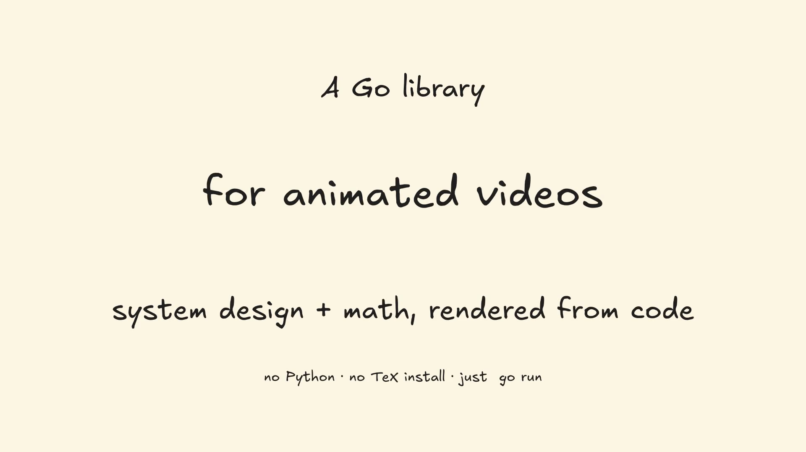

# goanim

**Animated diagrams for system design + math, written in Go.**

Build hand-drawn or AWS-clean explainer videos from code. No external
LaTeX install, no Manim setup — just `go run`.

[](https://pkg.go.dev/github.com/ankitsinghchadda/goanim)
[](https://goreportcard.com/report/github.com/ankitsinghchadda/goanim)
[](LICENSE)

## See it in 30 seconds

[](docs/media/showcase.mp4)

▶ **[Watch the 30-second showcase](docs/media/showcase.mp4)** — title
card, three style presets, a system diagram building itself, camera
focus, LaTeX math, end card. All rendered from
[`examples/showcase`](examples/showcase/main.go).

---

# Part 1 — Get started in 5 minutes

This section assumes you have never used Go and just want to render a
diagram. Follow the four steps below.

## Step 1 — Install Go

Go is the programming language goanim is written in. You need it to
run any example.

- **macOS**: `brew install go` (or download from <https://go.dev/dl/>)
- **Linux**: your package manager (`apt install golang`,
  `dnf install golang`, ...) or <https://go.dev/dl/>
- **Windows**: download the MSI installer from <https://go.dev/dl/>

Verify it worked. Open a terminal and run:

```bash
go version
```

You should see something like `go version go1.22.0 darwin/arm64`.

## Step 2 — Install ffmpeg

`ffmpeg` is the tool goanim uses to write MP4 video files. You only
need it for MP4 output; PNG-only examples work without it.

- **macOS**: `brew install ffmpeg`
- **Linux**: `sudo apt install ffmpeg` (Ubuntu/Debian) or your
  distro's equivalent
- **Windows**: download from <https://ffmpeg.org/download.html> and
  add it to your PATH

Verify:

```bash
ffmpeg -version
```

## Step 3 — Render your first diagram

Make a new folder and put this file in it as `hello.go`:

```go
package main

import (
    "fmt"
    "image/color"
    "os"

    "github.com/ankitsinghchadda/goanim/core/render"
    "github.com/ankitsinghchadda/goanim/core/scene"
    "github.com/ankitsinghchadda/goanim/core/style"
    "github.com/ankitsinghchadda/goanim/mobjects/icons"
    "github.com/ankitsinghchadda/goanim/mobjects/systemdesign"
)

func main() {
    hand, _ := render.Excalifont()
    sans, _ := render.Inter()

    r := render.NewCanvasRenderer(render.Options{Supersample: 2, DefaultFont: hand})
    r.BeginFrame(1920, 1080, color.RGBA{0xFD, 0xF6, 0xE3, 0xFF})

    s := scene.NewScene(1920, 1080).
        WithRenderer(r).
        WithDefaultStyle(style.PresetSketchy).
        WithFont(style.FontHandDrawn, hand).
        WithFont(style.FontSans, sans)

    client := icons.NewClient(1, "Client").MoveTo(-400, 0)
    server := icons.NewServer(2, "Server").MoveTo(400, 0)
    arrow := systemdesign.NewArrow(3, client, server).WithLabel("request")
    s.Add(client, server, arrow)

    s.RenderFrame()
    out, _ := os.Create("hello.png")
    defer out.Close()
    r.EncodePNG(out)
    fmt.Println("wrote hello.png")
}
```

In the same folder, run:

```bash
go mod init hello
go mod tidy
go run .
```

`go mod init` and `go mod tidy` are one-time setup — they tell Go to
download the goanim library. After that, `go run .` renders your
PNG.

Open `hello.png`. You should see a Client and Server with an arrow
labelled "request".

## Step 4 — Try the showcase

Clone this repo and render the full 30-second showcase video:

```bash
git clone https://github.com/ankitsinghchadda/goanim
cd goanim
go run ./examples/showcase
```

A file called `out_showcase.mp4` will appear. Open it.

## What next?

- Browse the [`examples/`](examples/) folder. Each numbered folder
  demonstrates one capability — start with `01_hello_world` and walk
  through.
- Read the **Quick reference** below for the API at-a-glance.
- Read [`docs/performance.md`](docs/performance.md) when you're
  ready to render long videos and want to tune the speed.

---

# Part 2 — Technical reference

The rest of this document is for developers writing real programs
against the library.

## Install

```bash
go get github.com/ankitsinghchadda/goanim
```

Requires Go 1.22+. `ffmpeg` on PATH is required for MP4 output but
not for PNG.

## Examples — capability map

Every numbered example demonstrates one feature axis. Run each with
`go run ./examples/<name>`.

| #   | Example                | Demonstrates                                                |
|-----|------------------------|-------------------------------------------------------------|
| 01  | `01_hello_world`       | Minimal scene; one PNG. The "is goanim installed?" check.   |
| 02  | `02_animations`        | Every animation primitive — DrawOn, FadeIn, MoveTo, PopIn, Flash, Sequence, Parallel, Stagger. |
| 03  | `03_styles`            | The same diagram rendered in all 5 style presets.           |
| 04  | `04_layouts`           | `HBox`, `VBox`, `Grid`, `Stack`, `Padding`, `AlignTo`.      |
| 05  | `05_icons`             | Contact sheet of all 39 system-design icons × 3 sloppiness. |
| 06  | `06_math`              | LaTeX equations, number lines, plotted functions.           |
| 07  | `07_system_diagram`    | Full system diagram: layout + arrows + packet flow MP4.     |
| 08  | `08_camera_direction`  | Pause, Camera (Zoom / Focus), LaserPointer.                 |
| 09  | `09_full_explainer`    | A 90-second scripted teaching video — direction layer at scale. |
|     | `showcase`             | The promotional video embedded at the top of this README.   |

Set `VARIANT=crisp` (or `=sketchy`) to render only one variant for
examples that produce multiple.

## Quick reference

### Build a scene

```go
r := render.NewCanvasRenderer(render.Options{DefaultFont: hand})
s := scene.NewScene(1920, 1080).
    WithRenderer(r).
    WithDefaultStyle(style.PresetSketchy).
    WithFont(style.FontHandDrawn, hand).
    WithFont(style.FontSans, sans)
```

### Add mobjects

```go
client := icons.NewClient(1, "Client").MoveTo(-400, 0)
server := icons.NewServer(2, "Server").MoveTo(400, 0)
arrow  := systemdesign.NewArrow(3, client, server).WithLabel("GET /url")
s.Add(client, server, arrow)
```

### Animate

```go
s.Play(sink, animation.Sequence(
    animation.DrawOn(client, 500*time.Millisecond),
    animation.DrawOn(server, 500*time.Millisecond),
    animation.DrawOn(arrow,  500*time.Millisecond),
))
```

### Frame the camera

```go
cam := direction.NewCamera()
s   := scene.NewScene(W, H).WithRenderer(r).WithCamera(cam)
s.Play(sink, cam.Focus(server, 1.8, 1*time.Second))
s.Play(sink, direction.Pause(2*time.Second))
s.Play(sink, cam.UnFocus(1*time.Second))
```

### Math

```go
eq := mathx.NewEquation("E = mc^2").WithHeight(120).MoveTo(0, 0)
s.Add(eq)
s.Play(sink, mathx.Write(eq, 1500*time.Millisecond))
```

### Encode to MP4

```go
enc, _ := render.NewVideoEncoder("out.mp4", render.VideoOptions{
    Width: 1920, Height: 1080, FPS: 60, CRF: 18, Preset: "fast",
})
defer enc.Close()
sink := frameSinkAdapter{enc: enc}    // adapter to scene.FrameWriter
```

## Style system

Five named presets:

- `PresetExcalidraw` — hand-drawn, light wobble, sans labels.
- `PresetSketchy` — heavier roughness, handwritten font, cream BG.
- `PresetCrisp` — clean filled glyphs, sharp edges, sans labels.
- `PresetBlueprint` — white-on-blue technical drawing aesthetic.
- `PresetNotebook` — graph-paper notebook look.

Override per-mobject — unset fields inherit from the scene:

```go
server := icons.NewServer(seed, "API").WithStyle(style.Style{
    Sloppiness: style.SloppinessCartoonist,
    FillStyle:  style.FillCrossHatch,
})
```

## Icon catalog

39 system-design icons across compute, storage, network, messaging,
observability, dataflow, and endpoints. Each ships in three
sloppiness levels and implements `Attachable` for arrow routing.

```bash
go run ./examples/05_icons   # generates a contact sheet of all 39
```

Full list:

- **Compute**: `Client`, `Server`, `Worker`, `Service`, `Function`,
  `Container`, `Pod`, `Cluster`, `VM`, `EdgeFunction`
- **Storage**: `Database`, `Storage`, `KeyValueStore`,
  `ObjectStorage`, `BlockStorage`, `RelationalDB`, `NoSQLDB`,
  `DataWarehouse`
- **Specialty DB**: `SearchIndex`, `TimeSeriesDB`, `GraphDB`
- **Networking**: `LoadBalancer`, `APIGateway`, `ReverseProxy`,
  `Firewall`, `DNS`, `CDN`
- **Messaging**: `MessageBroker`, `EventStream`, `PubSubTopic`
- **Dataflow**: `Queue`, `Stack`, `Cache`
- **Observability**: `Metrics`, `Logs`, `Tracing`
- **Endpoints**: `User`, `MobileClient`, `IoTDevice`

## Direction layer

`core/direction` provides primitives that direct the viewer's
attention rather than draw new content. Every direction primitive is
an `animation.Animation`, so it composes with `Sequence`, `Parallel`,
and `Stagger`.

| Primitive       | What it does                                            |
|-----------------|---------------------------------------------------------|
| `Pause`         | Emit zero-change frames (cheap via render reuse).       |
| `Camera.ZoomTo` | Pan + zoom to a target mobject.                         |
| `Camera.Focus`  | ZoomTo + dim every other mobject.                       |
| `Camera.UnFocus`| Release dim, return viewport to identity.               |
| `LaserPointer`  | Bright dot with fading trail traces a path.             |
| `Pulse`         | Scale a target up and back to draw attention.           |
| `Spotlight`     | Dim everything except a target (composes with camera).  |
| `UnderlineOn`   | Hand-drawn underline beneath a target.                  |
| `CircleAround`  | Hand-drawn ellipse encompassing a target.               |
| `Callout`       | Pill annotation with arrow pointing at target.          |
| `Caption`       | Frame-fixed text (ignores camera moves).                |
| `LabelNear`     | Text that tracks a target mobject.                      |
| `Replay`        | Re-run a captured animation at altered speed.           |

See [`examples/08_camera_direction`](examples/08_camera_direction)
and [`examples/09_full_explainer`](examples/09_full_explainer).

## LaTeX support

goanim uses **pure-Go LaTeX** via `tdewolff/canvas.ParseLaTeX`
(delegating to `star-tex.org/x/tex`). No `latex`, `xelatex`, or
`dvisvgm` installation is needed.

- A useful subset of LaTeX math is supported — inline expressions,
  fractions, integrals, sums, sub/superscripts, common symbols.
- Complex documents, custom packages, and `\begin{align}` blocks are
  out of scope.

Compiled equation paths are cached in `~/.cache/goanim/latex/`
(override with `GOANIM_CACHE_DIR`). First compile of a formula is
slow (~100 ms); subsequent compiles are near-instant.

## Repository layout

```
goanim/
├── cmd/bench/                # Benchmark runner
├── core/                     # Library core (public API)
│   ├── animation/            # Animation interface + primitives (+easing/)
│   ├── direction/            # Camera, pause, laser, spotlight, annotations
│   ├── geometry/             # Point, Path, Rect, Transform
│   ├── icon/                 # IconBase + Attachable contract
│   ├── layout/               # HBox, VBox, Grid, Stack, Padding, AlignTo
│   ├── mobject/              # Mobject, base shapes, cache
│   ├── render/               # CanvasRenderer + ffmpeg video encoder
│   ├── rough/                # Hand-drawn / sketchy stroke engine
│   ├── scene/                # Scene container + frame stepper
│   └── style/                # Style + presets + Tokens + Context
├── mobjects/                 # Higher-level mobjects (public API)
│   ├── icons/                # 39 system-design icons
│   ├── mathx/                # Equation, NumberLine, Axes, Graph
│   └── systemdesign/         # Arrow, Packet, composites
├── internal/                 # Not part of the public API
├── examples/                 # Numbered capability demos + showcase
└── docs/
    ├── media/                # showcase.mp4 + poster
    └── performance.md        # Benchmarking + profiling guide
```

## Performance

The smallest scene (3 icons, 5 seconds, sketchy) renders in ~5.5 s
at 1920×1080. The medium scene (10 icons, 30 s) renders in ~45 s.
Tuning knobs live in [`docs/performance.md`](docs/performance.md).

## Determinism

- Roughness is seeded — every primitive produces identical paths for
  identical `(Seed, Options)`.
- PNGs are byte-identical across runs.
- MP4s are byte-identical at a fixed ffmpeg preset.
- LaTeX output is cached + identical for the same source.

## Testing

```bash
go test ./...
```

## Known limitations

- **DrawOn outline reveal on closed shapes** uses opacity, not true
  path truncation. Arrows (open paths) DO use real truncation.
- **TransformEquation** is a cross-fade; a symbol-matching morph
  (where shared symbols reposition) is not yet implemented.
- **HighlightTerm per-symbol pulsing** is currently a no-op —
  requires per-glyph state.
- **LaTeX subset** — inline math only. No `\begin{align}`, no custom
  packages.
- **Custom SVG icon loader** (`icon.LoadSVG`) is stubbed; use
  `icon.LoadPNG` for branded logos (requires a renderer `DrawImage`
  extension — TODO).
- **Orthogonal arrow routing** can route oddly on non-adjacent
  rows / columns. An obstacle-avoidance pass would help.

## Contributing

Bug reports, feature requests, and PRs are welcome. See
[CONTRIBUTING.md](CONTRIBUTING.md).

## Licenses

- Code: [MIT](LICENSE).
- Excalifont: SIL OFL 1.1 — `core/render/embed/LICENSE.Excalifont`.
- Inter: SIL OFL 1.1 — `core/render/embed/LICENSE.Inter`.
- LaTeX rendering via `star-tex.org/x/tex` (BSD-style; see go.sum).
